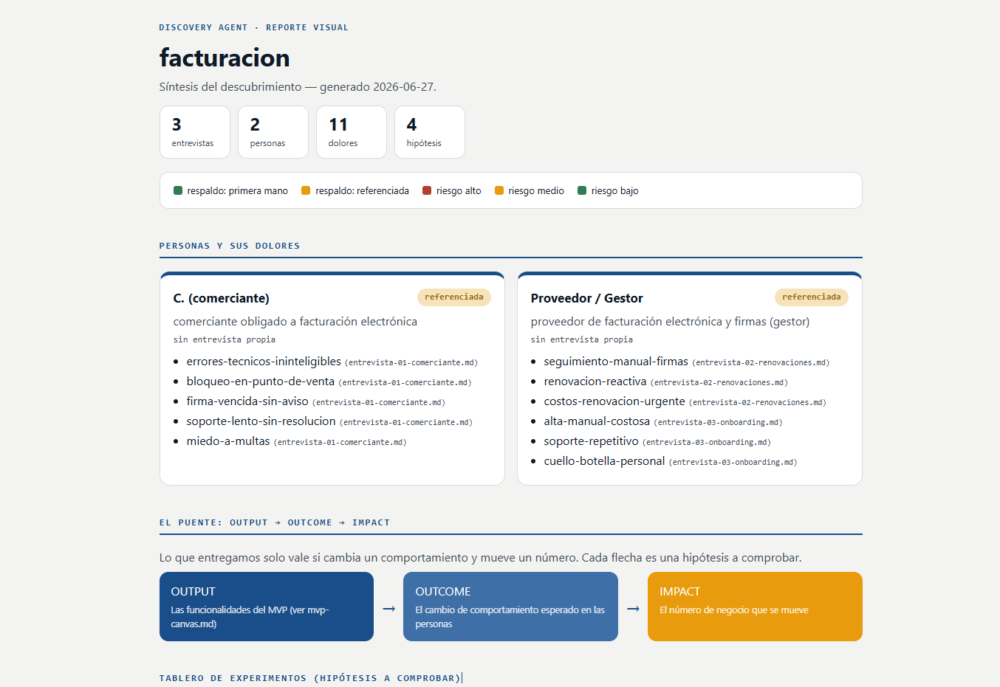
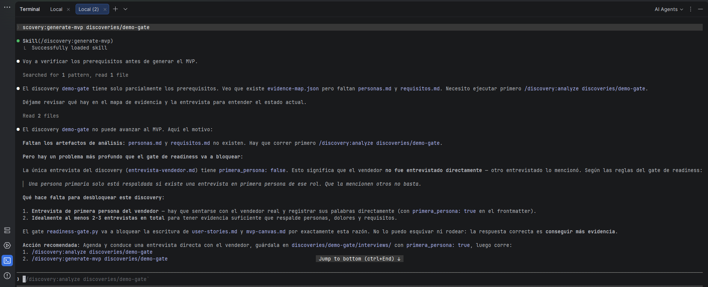
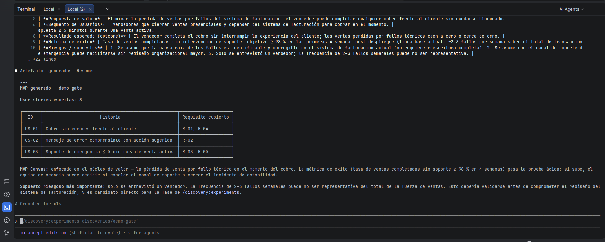

# Discovery Agent

> Convierte conocimiento de negocio crudo en artefactos de producto validables.  
> Agente de [Claude Code](https://claude.ai/code) — Unidad 1: Procesos de software · Ingeniería de Software, Maestría en Software, UPS.

---

## Objetivos cumplidos

| # | Objetivo específico | Cómo se cumple en este repositorio |
|---|---|---|
| 1 | Recopilar y organizar evidencia con al menos **dos entrevistas de primera mano** | `discoveries/facturacion/interviews/` contiene 3 entrevistas con `primera_persona: true`; dos roles distintos respaldan a las dos personas primarias del MVP |
| 2 | Configurar el proyecto con **CLAUDE.md, skill, comandos y hooks** | `CLAUDE.md` define las reglas y el flujo; `.claude/skills/discovery/SKILL.md` estandariza los formatos; `.claude/commands/discovery/` tiene los 4 comandos; `.claude/hooks/` tiene los 2 gates registrados en `settings.json` |
| 3 | Generar **artefactos trazables** — personas, requisitos, user stories INVEST y MVP Canvas | `personas.md`, `requisitos.md`, `user-stories.md` y `mvp-canvas.md` en `outputs/`; cada afirmación cita el archivo de entrevista fuente |
| 4 | Implementar el **readiness-gate** que bloquea el MVP con evidencia insuficiente | `.claude/hooks/readiness-gate.py` verifica evidencia antes de escribir `mvp-canvas.md` o `user-stories.md` |
| 5 | Formular **hipótesis falsables** y el **hypothesis-gate** que rechace hipótesis de vanidad | 4 hipótesis en `hypotheses.md` + `experiment-board.json`; `.claude/hooks/hypothesis-gate.py` exige umbral numérico, regla de fallo y métrica no de vanidad |
| 6 | **Demostrar un gate**: provocar un bloqueo y resolverlo | Ver evidencia visual abajo |
| 7 | **Comunicar el descubrimiento** mediante el reporte visual del agente | `.claude/scripts/build-report.py` genera `report.html`: dashboard autocontenido a color |

---

## Evidencia visual

### Reporte visual del discovery (objetivo 7)



---

### Demo del gate — bloqueo (objetivo 6)

El readiness-gate detecta que la persona primaria no tiene entrevista de primera mano y bloquea la generación del MVP:



---

### Demo del gate — resolución (objetivo 6)

Tras agregar la entrevista de primera mano faltante, el gate pasa y los artefactos se generan:



---

## Qué es

**Discovery Agent** estructura el proceso de descubrimiento de producto *antes* de escribir una sola línea de código.

Dado un conjunto de entrevistas en crudo, el agente extrae **personas**, **dolores**, **requisitos**, **user stories** y un **MVP Canvas**; luego convierte los supuestos más riesgosos en **hipótesis falsables** con experimentos baratos para validarlas.

El agente es **genérico**: no está atado a ningún dominio. Cada caso de negocio es un *discovery* independiente bajo `discoveries/`.

---

## Flujo de trabajo

```
Entrevistas en Markdown  (interviews/*.md)
         │
         ▼
/discovery:analyze       →  personas.md · requisitos.md · evidence-map.json
         │
         ▼  ← readiness-gate (bloquea si la evidencia es insuficiente)
/discovery:generate-mvp  →  user-stories.md · mvp-canvas.md
         │
         ▼  ← hypothesis-gate (bloquea hipótesis no falsables o de vanidad)
/discovery:experiments   →  hypotheses.md · experiment-board.json
         │
         ▼
/discovery:report        →  report.html  (dashboard visual autocontenido)
```

---

## Gates automáticos

Dos hooks de validación (`PreToolUse`) bloquean la escritura cuando la evidencia o las hipótesis no cumplen el estándar. Se auto-ubican desde la ruta del archivo que Claude intenta escribir, por lo que funcionan para cualquier discovery.

### Gate de readiness (`readiness-gate.py`)

Se activa antes de escribir `mvp-canvas.md` o `user-stories.md`. Verifica:

- Existe `evidence-map.json` (producto de `/discovery:analyze`)
- Hay al menos 2 entrevistas en `interviews/`
- Cada persona `primary: true` tiene una entrevista `primera_persona: true` en disco
- Ningún dolor tiene la fuente apuntando a un archivo inexistente

Si falla → `exit 2` + mensaje con el motivo exacto. No se puede sortear renombrando el archivo.

### Gate de hipótesis (`hypothesis-gate.py`)

Se activa antes de escribir `hypotheses.md` o `experiment-board.json`. Verifica:

- Existe `mvp-canvas.md` (los supuestos salen del MVP)
- Hay al menos una hipótesis en el tablero
- Todos los campos requeridos están presentes y no vacíos
- `threshold` contiene un número o porcentaje concreto (no "muchos" ni "la mayoría")
- `decision` contempla explícitamente el escenario de fallo (`si falla`, `pivotar`, `descartar`…)
- `metric` no es de vanidad (descargas, likes, story points, líneas de código, seguidores…)

---

<details>
<summary>📁 Estructura del repositorio</summary>

```
Discovery-Agents/
├── CLAUDE.md                        # Constitución del agente: reglas, flujo y gates
├── .claude/
│   ├── settings.json                # Registro de hooks (PreToolUse)
│   ├── commands/discovery/          # analyze · generate-mvp · experiments · report
│   ├── hooks/
│   │   ├── readiness-gate.py        # Bloquea el MVP si la evidencia es insuficiente
│   │   └── hypothesis-gate.py       # Bloquea hipótesis no falsables o de vanidad
│   ├── scripts/
│   │   └── build-report.py          # Generador determinista del reporte HTML
│   └── skills/discovery/
│       └── SKILL.md                 # Estándar de formato y trazabilidad
└── discoveries/
    ├── _template/                   # Plantilla vacía para nuevos casos
    └── facturacion/                 # Discovery de ejemplo completo
        ├── interviews/
        │   ├── entrevista-01-comerciante.md
        │   ├── entrevista-02-renovaciones.md
        │   └── entrevista-03-onboarding.md
        └── outputs/
            ├── evidence-map.json
            ├── personas.md
            ├── requisitos.md
            ├── user-stories.md
            ├── mvp-canvas.md
            ├── hypotheses.md
            ├── experiment-board.json
            └── report.html
```

</details>

---

<details>
<summary>📄 Artefactos generados</summary>

| Archivo | Comando | Contenido |
|---|---|---|
| `personas.md` | `:analyze` | Personas + stakeholders con diagrama Mermaid de trazabilidad |
| `requisitos.md` | `:analyze` | Requisitos funcionales y no funcionales (R-01…R-NN) |
| `evidence-map.json` | `:analyze` | Mapa de trazabilidad entre entrevistas, personas y dolores — lo audita el readiness-gate |
| `user-stories.md` | `:generate-mvp` | User stories en formato INVEST con criterios Given/When/Then |
| `mvp-canvas.md` | `:generate-mvp` | Canvas de 7 bloques con cadena Output → Outcome → Impact |
| `hypotheses.md` | `:experiments` | Test cards ordenadas por riesgo (alto / medio / bajo) |
| `experiment-board.json` | `:experiments` | Tablero machine-readable que audita el hypothesis-gate |
| `report.html` | `:report` | Dashboard visual autocontenido, sin dependencias externas |

</details>

---

<details>
<summary>📋 Reglas de trabajo</summary>

| Regla | Descripción |
|---|---|
| **Cero invención** | Ningún artefacto puede afirmar algo que no esté respaldado por una entrevista real |
| **Trazabilidad** | Cada persona, dolor y requisito cita el archivo fuente (p. ej. `entrevista-01-comerciante.md`) |
| **Primera persona** | Una persona primaria solo sustenta el MVP si existe una entrevista en primera persona de ese rol |
| **Aislamiento** | Los artefactos de un discovery nunca se mezclan con otro |
| **Idioma** | Español, salvo términos técnicos (user story, MVP, stakeholder) |

</details>

---

<details>
<summary>🚀 Uso rápido — cómo crear un nuevo discovery</summary>

```bash
# 1. Copia la plantilla para tu nuevo caso
cp -r discoveries/_template discoveries/mi-caso

# 2. Agrega entrevistas en discoveries/mi-caso/interviews/
#    Cada archivo debe tener frontmatter:
#      rol_entrevistado: <rol>
#      primera_persona: true | false
#      anonimizada: true
```

Luego, dentro de Claude Code:

```
/discovery:analyze discoveries/mi-caso
/discovery:generate-mvp discoveries/mi-caso
/discovery:experiments discoveries/mi-caso
/discovery:report discoveries/mi-caso
```

Los artefactos se generan en `discoveries/mi-caso/outputs/`.

**Requisitos previos:**

| Herramienta | Versión |
|---|---|
| [Claude Code](https://claude.ai/code) | latest |
| Python | 3.x |

</details>

---

## Discovery de ejemplo

`discoveries/facturacion/` contiene un discovery completo sobre un **proveedor/gestor de facturación electrónica y firmas digitales**: tres entrevistas en primera persona (comerciante, renovaciones, onboarding), dos personas primarias, diez requisitos trazados, cuatro user stories INVEST, cuatro hipótesis falsables ordenadas por riesgo y un dashboard HTML generado desde los JSON. Úsalo como referencia o para recorrer el flujo completo con los gates activos.

---

*Unidad 1 — Ingeniería de Software · Maestría en Software, Universidad Politécnica Salesiana (UPS)*
