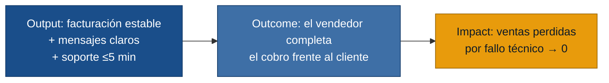

# MVP Canvas — Sistema de Facturación Confiable (demo-gate)

| Bloque | Contenido |
|---|---|
| **Propuesta de valor** | Eliminar la pérdida de ventas por fallos del sistema de facturación: el vendedor puede completar cualquier cobro frente al cliente sin quedarse bloqueado. |
| **Segmento de usuarios** | Vendedores que cierran ventas presenciales y dependen del sistema de facturación para cobrar en el momento. |
| **Funcionalidades mínimas** | 1. Proceso de cobro estable con tasa de error < 2 % en horario de ventas. 2. Mensajes de error comprensibles con acción concreta sugerida. 3. Canal de soporte de emergencia con respuesta ≤ 5 minutos durante una venta activa. |
| **Resultado esperado (outcome)** | El vendedor completa el cobro sin interrumpir la experiencia del cliente; las ventas perdidas por fallos técnicos caen a cero o cerca de cero. |
| **Métrica de éxito** | Tasa de ventas completadas sin intervención de soporte: objetivo ≥ 98 % en las primeras 4 semanas post-despliegue (línea base actual: ~2–3 fallos por semana sobre el total de transacciones). |
| **Riesgos / supuestos** | 1. Se asume que la causa raíz de los fallos es identificable y corregible en el sistema de facturación actual (no requiere reescritura completa). 2. Se asume que el canal de soporte de emergencia puede habilitarse sin rediseño organizacional mayor. 3. Solo se entrevistó un vendedor; la frecuencia de 2–3 fallos semanales puede no ser representativa. |
| **Fuera de alcance (por ahora)** | — Rediseño completo del sistema de facturación. — Automatización del proceso de ventas. — Integración con nuevos medios de pago. — Soporte multicanal o chatbot. Estas funciones no atacan el dolor central y añadirían complejidad antes de validar la estabilidad básica. |

---

## Cadena de valor

