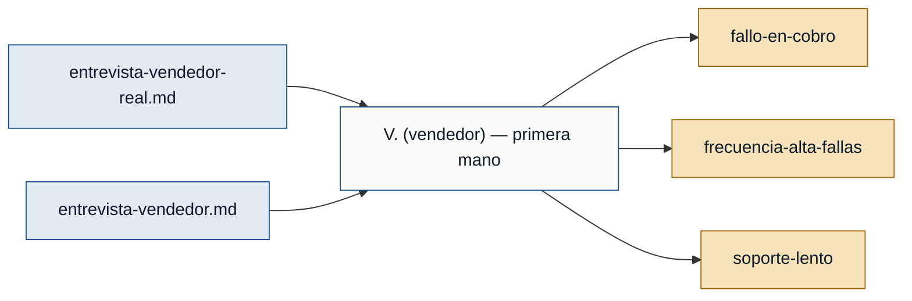

# Personas y Stakeholders — demo-gate

## Personas

### V. (vendedor) — vendedor
- **Contexto:** Vendedor que interactúa directamente con clientes en el momento del cobro.
- **Objetivo principal:** Cerrar ventas sin interrupciones técnicas, manteniendo la confianza del cliente.
- **Dolores:**
  - El sistema de facturación falla justo cuando el cliente quiere pagar, generando errores incomprensibles y pérdida de ventas. *(entrevista-vendedor-real.md)*
  - La falla ocurre al menos dos o tres veces por semana, siempre con el cliente presente. *(entrevista-vendedor-real.md)*
  - No existe soporte inmediato; el tiempo de respuesta del soporte es demasiado largo para una situación de venta activa. *(entrevista-vendedor-real.md)*
- **Respaldo:** `primera mano` — existe entrevista directa en `entrevista-vendedor-real.md`.

---

## Stakeholders

### Entrevistado que mencionó al vendedor *(rol no especificado)*
- **Interés en el sistema:** Reportó de forma indirecta que el vendedor pierde ventas por fallas en el sistema de facturación; tiene interés en que el proceso de cobro funcione sin interrupciones.
- **Fuente:** `entrevista-vendedor.md`

---

## Mapa de trazabilidad

