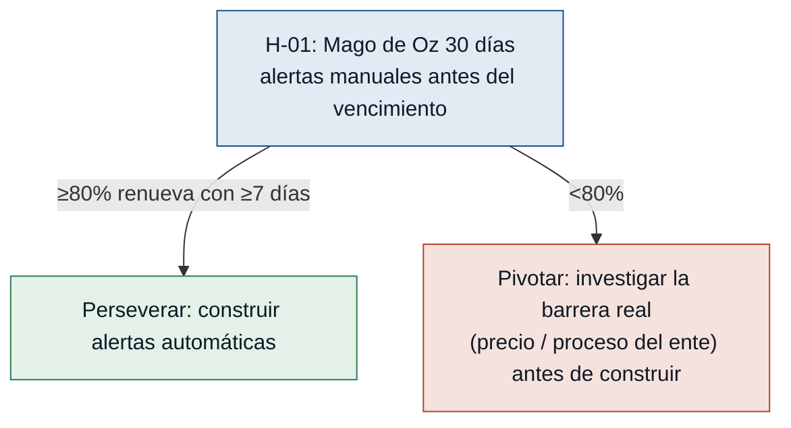

# Hipótesis y experimentos — Gestor de vencimientos de firmas digitales

Cada supuesto riesgoso del MVP Canvas se convierte aquí en una hipótesis falsable
y en el experimento más barato que la responde. Las test cards van ordenadas de
**mayor a menor riesgo**: primero se prueba lo que más puede tumbar el MVP.

> Marco: el puente output → outcome → impact es una **hipótesis**, y las hipótesis
> **se comprueban**. Cada experimento es comprar información barata sobre el riesgo
> más grande antes de construir.

---

### [H-01] Las alertas anticipadas convierten renovación reactiva en proactiva — riesgo: alto
- **Supuesto a probar:** con alertas anticipadas, el Proveedor/Gestor pasa de renovar
  tras el vencimiento a renovar antes. Es el outcome central del MVP. `(renovacion-reactiva, costos-renovacion-urgente — entrevista-02-renovaciones.md)`
- **Hipótesis:** Creemos que el Proveedor/Gestor renovará firmas con anticipación si
  recibe alertas automáticas N días antes del vencimiento, porque su problema hoy es
  la falta de visibilidad, no la falta de voluntad.
- **Señal medible:** % de renovaciones de la cartera del proveedor piloto completadas
  antes de la fecha de vencimiento (vs. después).
- **Criterio de éxito:** ≥80% de las firmas que vencen durante un piloto de 30 días se
  renuevan con ≥7 días de anticipación.
- **Experimento:** Mago de Oz de 30 días con 1 proveedor real. Sobre una planilla de
  cartera, enviamos a mano las alertas N días antes de cada vencimiento (sin construir
  el sistema) y medimos cuántas renovaciones ocurren a tiempo.
- **Caja de tiempo/costo:** 30 días · costo bajo (trabajo manual, sin desarrollo).
- **Regla de decisión:** Si pasa (≥80% a tiempo) → la propuesta de valor se sostiene;
  construir las alertas automáticas. Si falla (<80%) → la alerta no basta; investigar
  la barrera real (precio de renovación, proceso del ente tributario) y pivotar antes
  de construir.

### [H-02] El proveedor adopta el tablero y mantiene los datos al día — riesgo: alto
- **Supuesto a probar:** el Proveedor/Gestor adoptará la herramienta y mantendrá
  actualizada la fecha de vencimiento de cada cliente, en vez de seguir con su
  seguimiento manual. `(seguimiento-manual-firmas — entrevista-02-renovaciones.md)`
- **Hipótesis:** Creemos que el Proveedor/Gestor cargará y mantendrá actualizadas las
  fechas de vencimiento de su cartera si le damos un tablero simple de alta de clientes,
  porque ya hace ese seguimiento de forma manual y el dolor de la renovación reactiva
  es suyo.
- **Señal medible:** % de clientes activos de la cartera del proveedor piloto con fecha
  de vencimiento registrada y vigente en el tablero.
- **Criterio de éxito:** ≥90% de los clientes activos del proveedor piloto tienen su
  fecha de vencimiento cargada y correcta en el tablero a los 14 días del alta.
- **Experimento:** Concierge de 2 semanas. Damos al proveedor una planilla compartida
  (Google Sheets) como tablero de cartera y le pedimos cargar sus clientes; al final
  auditamos cobertura y exactitud de los datos.
- **Caja de tiempo/costo:** 2 semanas · costo ~0.
- **Regla de decisión:** Si pasa (≥90%) → construir el módulo de registro/tablero
  confiando en la adopción. Si falla (<90%) → identificar la fricción (tiempo de carga,
  falta de incentivo), rediseñar el alta (p. ej. importar desde su planilla actual) o
  descartar el modelo de carga manual antes de construir.

### [H-03] El cliente final actúa sobre la alerta a tiempo — riesgo: medio
- **Supuesto a probar:** el cliente final inicia o autoriza la renovación con tiempo
  suficiente antes del vencimiento. `(firma-vencida-sin-aviso — entrevista-01-comerciante.md; entrevista-02-renovaciones.md)`
- **Hipótesis:** Creemos que los clientes alertados directamente iniciarán la renovación
  a tiempo si reciben un aviso claro N días antes, porque su dolor es el bloqueo en el
  punto de venta, no el desinterés.
- **Señal medible:** % de clientes que, tras recibir la alerta, responden o inician el
  trámite de renovación dentro de 7 días.
- **Criterio de éxito:** ≥60% de los clientes alertados inician la renovación dentro de
  los 7 días del aviso.
- **Experimento:** Prueba dirigida con la cartera del proveedor piloto: enviar la alerta
  a 15–20 clientes con vencimiento próximo y medir cuántos reaccionan en 7 días.
- **Caja de tiempo/costo:** 2 semanas · costo bajo.
- **Regla de decisión:** Si pasa (≥60%) → mantener la alerta directa al cliente en el
  MVP. Si falla (<60%) → la alerta directa no mueve al cliente; pivotar a que la alerta
  empodere al proveedor para gestionar la renovación por él, o descartar el aviso directo.

### [H-04] WhatsApp supera al email como canal de aviso — riesgo: medio
- **Supuesto a probar:** el canal elegido (email o WhatsApp) es el que el cliente revisa
  a tiempo. `(entrevista-02-renovaciones.md)`
- **Hipótesis:** Creemos que WhatsApp logrará mayor lectura/respuesta que el email para
  los avisos de vencimiento si enviamos la misma alerta por ambos canales, porque el
  comerciante revisa el celular más que el correo.
- **Señal medible:** tasa de lectura/respuesta de la alerta por canal (WhatsApp vs.
  email) en una prueba A/B.
- **Criterio de éxito:** el canal ganador alcanza ≥50% de lectura/respuesta en 72 h, con
  una diferencia ≥15 puntos sobre el otro canal.
- **Experimento:** A/B de bajo costo. Dividir a los clientes alertados en dos grupos
  (email vs. WhatsApp) con el mismo mensaje y medir lectura/respuesta a 72 h.
- **Caja de tiempo/costo:** 1 semana · costo bajo.
- **Regla de decisión:** Si pasa (un canal ≥50% y gana por ≥15 pts) → adoptar ese canal
  como principal del MVP. Si falla (ninguno llega a 50%) → ambos canales son débiles;
  investigar un canal alternativo (SMS o llamada) antes de comprometer el MVP.

---

## Árbol de decisión del experimento #1 (el de mayor riesgo)

---

## Resumen

- **4 hipótesis** derivadas de los supuestos riesgosos del MVP Canvas (2 de riesgo
  alto, 2 de riesgo medio).
- **La #1 por riesgo es H-01:** que las alertas anticipadas realmente conviertan la
  renovación reactiva en proactiva. Es el outcome central del MVP; si no se cumple, el
  producto no entrega su propuesta de valor.
- **El experimento que la ataca primero** es un **Mago de Oz de 30 días**: enviar las
  alertas a mano sobre una planilla de cartera, sin construir nada, y medir si el
  proveedor renueva a tiempo. Información barata sobre el mayor riesgo antes de invertir
  en desarrollo.
