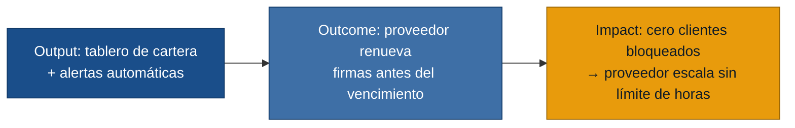

# MVP Canvas — Gestor de vencimientos de firmas digitales

| Bloque | Contenido |
|---|---|
| Propuesta de valor | Pasar al Proveedor/Gestor de modo reactivo a proactivo: saber con anticipación qué firmas vencen, alertar a tiempo y renovar sin recargo ni clientes bloqueados. |
| Segmento de usuarios | Proveedor/Gestor con cartera de 10–100+ clientes con firmas digitales activas. |
| Funcionalidades mínimas | 1. Registro de clientes con fecha de vencimiento de firma. 2. Alertas automáticas al Proveedor y al cliente N días antes del vencimiento. 3. Tablero de cartera con estados: al día / por vencer / vencida. |
| Resultado esperado (outcome) | El Proveedor/Gestor renueva el 80%+ de firmas con ≥7 días de anticipación al vencimiento; cero clientes bloqueados por vencimiento no anticipado. |
| Métrica de éxito | % de renovaciones completadas antes de la fecha de vencimiento (meta: ≥80% en los primeros 30 días de piloto). Prueba ácida: si sube, el proveedor decide si puede sumar más clientes sin contratar soporte. |
| Riesgos / supuestos | 1. El proveedor conoce o puede obtener la fecha de vencimiento de cada firma. `(entrevista-02-renovaciones.md)` 2. El proveedor adopta la herramienta para registrar ese dato. 3. El cliente actúa sobre la alerta con tiempo suficiente. `(entrevista-02-renovaciones.md)` 4. El canal elegido (email/WhatsApp) es el que el cliente revisa. |
| Fuera de alcance (por ahora) | Integración automática con el ente tributario para obtener fechas. Onboarding automatizado de clientes `(entrevista-03-onboarding.md)`. Traducción de errores técnicos para el comerciante `(entrevista-01-comerciante.md)`. |

---

