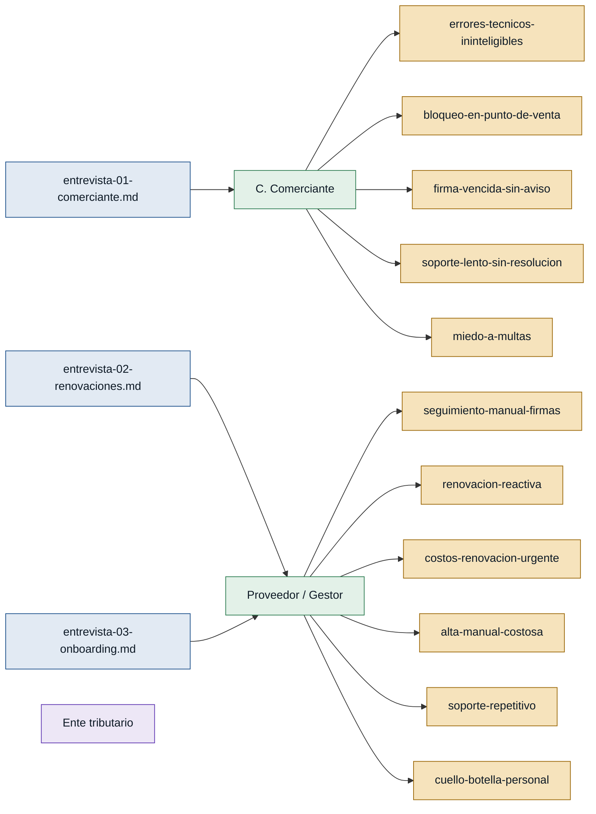

# Personas y Stakeholders — Facturación electrónica

> **Clave de color:** verde = primera mano · morado = stakeholder sin entrevista directa.

---

## Personas

### C. (comerciante) — comerciante obligado a facturación electrónica

- **Contexto:** pequeño comerciante con baja familiaridad tecnológica, migrado forzosamente a la facturación electrónica por mandato del ente tributario; opera en punto de venta con cliente presente.
- **Objetivo principal:** cobrar y emitir facturas sin necesidad de entender la tecnología subyacente ni depender de terceros para resolver problemas.
- **Dolores:**
  - Mensajes de error técnicos e incomprensibles bloquean la emisión de facturas en plena venta. `(entrevista-01-comerciante.md)`
  - No puede entregar la factura al cliente que ya pagó cuando el sistema falla. `(entrevista-01-comerciante.md)`
  - La firma electrónica venció sin aviso previo; estuvo varios días sin poder facturar, perdiendo ventas. `(entrevista-01-comerciante.md)`
  - El soporte telefónico tiene esperas largas y no resuelve de forma inmediata. `(entrevista-01-comerciante.md)`
  - Busca ayuda en familiares o YouTube, pero los recursos no aplican a su sistema concreto. `(entrevista-01-comerciante.md)`
  - Vive con estrés y miedo constante a ser multado por no poder emitir facturas. `(entrevista-01-comerciante.md)`
- **Respaldo:** `primera mano` — `entrevista-01-comerciante.md`

---

### Proveedor / Gestor — proveedor de facturación electrónica y firmas (gestor)

- **Contexto:** emprendedor que vende y administra servicios de facturación electrónica y firmas digitales para una cartera de múltiples comerciantes PYME; opera hoy con Excel, WhatsApp y trabajo completamente manual.
- **Objetivo principal:** escalar la cartera de clientes sin que su tiempo personal sea el cuello de botella.
- **Dolores:**
  - Controla vencimientos de firmas en Excel, WhatsApp o de memoria; no tiene alertas automáticas. `(entrevista-02-renovaciones.md)`
  - Se entera del vencimiento cuando el cliente ya está bloqueado y enojado. `(entrevista-02-renovaciones.md)`
  - Las renovaciones de último minuto generan recargos evitables y dañan la relación con el cliente. `(entrevista-02-renovaciones.md)`
  - El alta de cada cliente nuevo es completamente manual, consume horas y no reutiliza nada del proceso anterior. `(entrevista-03-onboarding.md)`
  - Las mismas 5–6 preguntas de soporte se repiten; responde copiando y pegando el mismo instructivo. `(entrevista-03-onboarding.md)`
  - Es el cuello de botella de su negocio: más clientes significan más horas personales, no crecimiento real. `(entrevista-03-onboarding.md)`
- **Respaldo:** `primera mano` — `entrevista-02-renovaciones.md`, `entrevista-03-onboarding.md`

---

## Stakeholders

### Ente tributario (SRI / DIAN / SUNAT según el país)

- **Interés en el sistema:** garantizar el cumplimiento de la obligación de facturación electrónica; es quien impone plazos, sanciones y la exigencia de la firma electrónica vigente.
- **Fuente:** `entrevista-01-comerciante.md` (mencionado como mandante de la migración obligatoria y fuente del riesgo de multas).

> Nota: no existe entrevista directa al ente tributario. Su rol es regulatorio y contextual; no es usuario del sistema pero define restricciones críticas de negocio.
